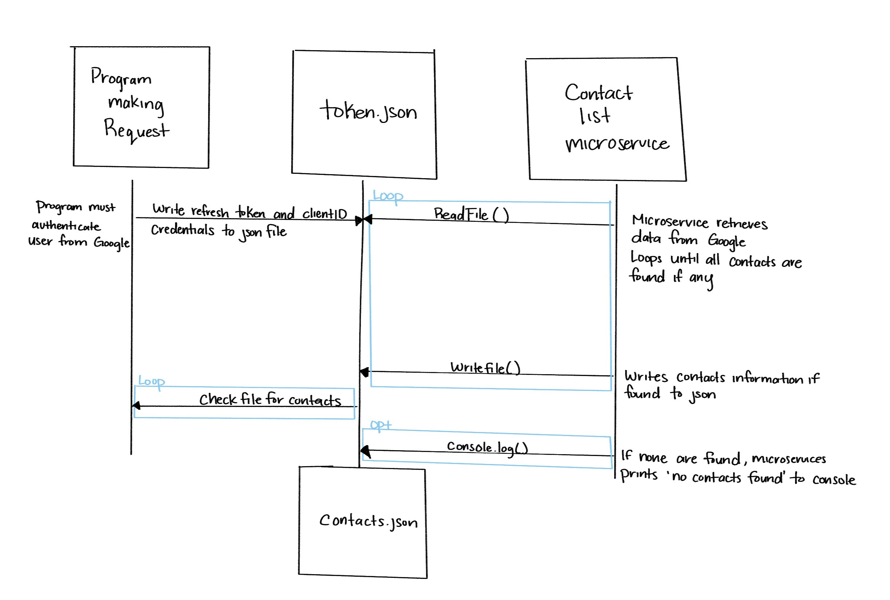

# 361Microservice
Communication Contract 

## A. How to programatically request data:
  Write to the token.json file with the information provided by Google's authentication when a user logs in.
  Example: 
  ```bash
    JSON.stringify({
      type: 'authorized_user',
      client_id: key.client_id,                        # client_id and client_secret are taken from credentials.json
      client_secret: key.client_secret,
      refresh_token: client.credentials.refresh_token,
    });
```
Make sure you have npm and the following library installed:
```bash
npm install googleapis@105 @google-cloud/local-auth@2.1.0 --save
```

## B. How to programatically receive data:
  Read from contacts.json to receive name and email from user's contacts if they have any.

## C. UML Sequence Diagram:

